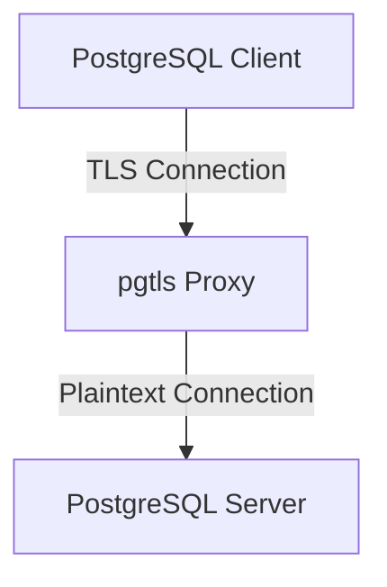

# pgtls: A Protocol-Aware TLS Proxy for PostgreSQL

[](https://github.com/tyrchen/pgtls/actions)

`pgtls` is a high-performance, protocol-aware TLS termination proxy for PostgreSQL, written in Rust.

It is designed to solve a specific, well-known problem: standard TLS proxies (like Nginx, HAProxy, or cloud load balancers) cannot correctly handle PostgreSQL's TLS negotiation, because PostgreSQL uses a `STARTTLS`-like mechanism within its own protocol instead of initiating a TLS handshake immediately after the TCP connection is established.

`pgtls` acts as a TLS termination proxy that understands the PostgreSQL wire protocol, correctly handles the `SSLRequest` negotiation, terminates TLS connections from clients, and forwards traffic as plaintext to backend PostgreSQL servers.

## Features

*   **PostgreSQL Protocol-Aware**: Correctly handles the `SSLRequest` handshake process.
*   **TLS Termination**: Provides TLS security layer for clients while connecting to plaintext backends.
*   **Simplified Architecture**: Terminates TLS at the proxy and forwards plaintext to backend servers.
*   **Secure by Default**: Built with Rust, `rustls`, and `tokio` for a modern, safe, and asynchronous architecture.
*   **Mutual TLS (mTLS) Support**: Can be configured to require and verify client certificates.
*   **Configuration via TOML**: Simple and clear configuration.

## How It Works



For a detailed architectural overview and protocol specifications, please see the documents in the `/specs` directory.

## Getting Started

*(This section will be updated once the first release is available.)*

1.  **Installation**:
    ```bash
    # Coming soon
    ```

2.  **Configuration**: Create a `pgtls.toml` file. See [`specs/004-configuration.md`](specs/004-configuration.md) for a full reference.

    A single `pgtls` instance can manage multiple proxy routes. Each route maps one listener to one backend.

    ```toml
    # pgtls.toml
    log_level = "info"

    # Proxy route #1: Secure connection with mTLS from clients to plaintext backend.
    [[proxy]]
      [proxy.listener]
      bind_address = "0.0.0.0:6432"
      server_cert = "/etc/pgtls/certs/proxy-server.pem"
      server_key = "/etc/pgtls/certs/proxy-server.key"
      mtls = true
      client_ca = "/etc/pgtls/certs/client-ca.pem"

      [proxy.backend]
      address = "db.example.com:5432"

    # Proxy route #2: Add a TLS layer to a plaintext-only backend.
    [[proxy]]
      [proxy.listener]
      bind_address = "127.0.0.1:6433"
      server_cert = "/etc/pgtls/certs/internal-proxy.pem"
      server_key = "/etc/pgtls/certs/internal-proxy.key"

      [proxy.backend]
      address = "10.0.1.50:5432"
    ```

3.  **Run the proxy**:
    ```bash
    pgtls --config pgtls.toml
    ```

## License

This project is distributed under the terms of the MIT license. See [LICENSE.md](LICENSE.md) for details.

Copyright 2025 Tyr Chen
