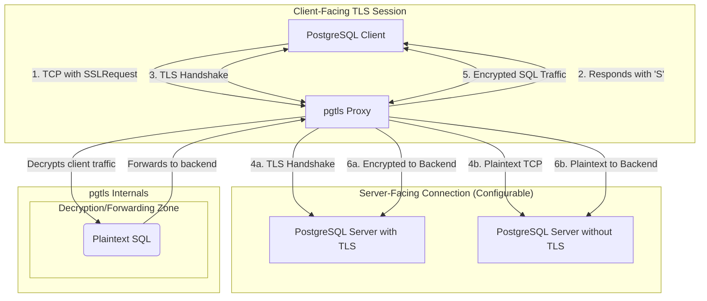

# **Specification 001: Architectural Overview**

## **1. Introduction**

This document provides a high-level architectural overview of `pgtls`, a protocol-aware TLS termination proxy for PostgreSQL. The primary goal of `pgtls` is to enable standard TLS termination for PostgreSQL connections, overcoming the limitations of generic TLS proxies that are incompatible with PostgreSQL's unique `STARTTLS`-like negotiation protocol.

## **2. Core Design Principles**

The architecture of `pgtls` is founded on the following principles:

*   **Protocol-Awareness**: The proxy must have deep knowledge of the PostgreSQL wire protocol. It must be capable of parsing the initial bytes of a client connection to differentiate between a standard `StartupMessage` and the special `SSLRequest` message. This is the cornerstone of its ability to function correctly.

*   **Stateful Connection Handling**: Each client connection is managed by a state machine that tracks its lifecycle. The state transitions from initial negotiation to TLS handshaking and finally to data streaming, ensuring that each phase of the connection is handled correctly.

*   **Dual TLS Contexts**: As a TLS terminating proxy, `pgtls` manages two independent TLS sessions for each proxied connection:
    1.  **Client-Facing Session**: The proxy acts as a TLS server, terminating the TLS connection from the client application.
    2.  **Server-Facing Session**: The proxy acts as a client, initiating a new TLS/plaintext connection to the backend PostgreSQL server.

*   **Centralized Policy Enforcement**: The proxy serves as a critical security checkpoint. It can enforce consistent and strict TLS policies, such as requiring TLS 1.3 for all backend connections, regardless of the client's configuration. This centralizes security policy management and simplifies client configuration.

## **3. High-Level Architecture**

`pgtls` operates as a "man-in-the-middle" by design, positioned logically between the PostgreSQL client and the PostgreSQL server.

### **3.1. Connection Flow**

1.  A PostgreSQL client, configured to use TLS, connects to the `pgtls` listener port.
2.  The client sends the 8-byte `SSLRequest` message.
3.  `pgtls` identifies the `SSLRequest` and responds with a single `'S'` byte, confirming its willingness to proceed with TLS.
4.  `pgtls` performs a TLS handshake with the client, presenting its own server certificate. The client establishes a secure session with the proxy.
5.  Based on its configuration, `pgtls` establishes a connection to the backend PostgreSQL server.
    *   **If backend TLS is enabled**: The proxy acts as a TLS client, performs the `SSLRequest` negotiation, and establishes a secure TLS session with the backend server.
    *   **If backend TLS is disabled**: The proxy establishes a standard plaintext TCP connection to the backend server.
6.  Once both the client-facing and server-facing connections are established, `pgtls` enters the data streaming phase. It decrypts data from the client, and then forwards it to the server (either over its TLS session or the plaintext TCP connection). The process is reversed for data flowing from the server to the client.

## **4. Application Startup Flow**

The `pgtls` application will operate as follows:

1.  **Load Configuration**: The application starts and parses the main TOML configuration file.
2.  **Initialize Proxies**: For each `[[proxy]]` entry defined in the configuration, the application will:
    a.  Load and validate all associated listener and backend settings, including certificates.
    b.  Create the necessary `rustls` configurations for the listener and backend.
    c.  Bind to the specified `listener.bind_address`.
    d.  Spawn a dedicated asynchronous task to listen for connections on that address.
3.  **Accept Connections**: Each listener task will independently accept incoming TCP connections. When a connection is received, it will spawn a new connection handler task, providing it with the specific backend configuration for that route.

This architecture allows `pgtls` to manage multiple, isolated proxy routes concurrently within a single process.
