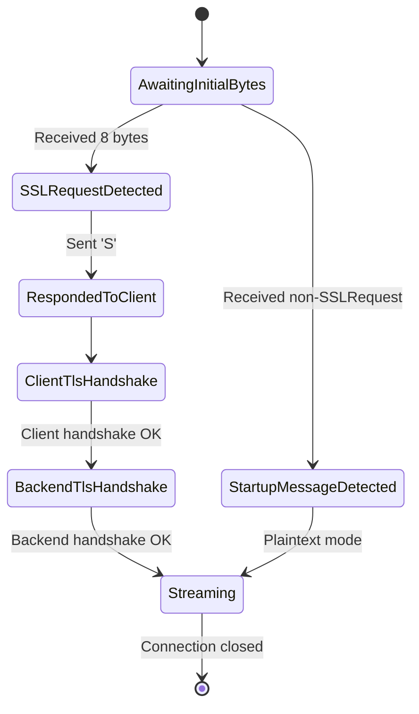

# **Specification 002: Protocol Handling and State Management**

## **1. Introduction**

This document specifies how `pgtls` will handle the initial phase of a PostgreSQL connection. Correctly parsing the protocol preamble and managing the connection state is critical to the proxy's function.

## **2. The `SSLRequest` Message**

The proxy must be able to identify and correctly respond to the PostgreSQL `SSLRequest` message.

### **2.1. Message Format**

The `SSLRequest` message is a fixed-size 8-byte sequence:

*   **Bytes 0-3**: Message length. A 32-bit integer (big-endian) with a value of `8`.
*   **Bytes 4-7**: SSL request code. A 32-bit integer (big-endian) with a value of `80877103`.

A constant for the request code shall be defined in the implementation:
`const SSL_REQUEST_CODE: u32 = 80877103;`

### **2.2. Server Response**

Upon receiving a valid `SSLRequest`, the proxy must respond with a single byte to the client:

*   **`'S'` (ASCII 83)**: Indicates that the server is willing to perform a TLS handshake. The proxy will always respond with `'S'` if it is configured to handle TLS.
*   **`'N'` (ASCII 78)**: Indicates that the server is not willing to perform a TLS handshake. This response should only be sent if the proxy is explicitly configured to refuse TLS for a specific listener or policy, which is not a primary use case.

## **3. Connection State Machine**

The proxy shall manage each client connection using a state machine. This ensures that the connection progresses through the required phases in the correct order.

### **3.1. State Definitions**

*   **`AwaitingInitialBytes`**: The initial state after a TCP connection is accepted. The proxy is waiting to read the first few bytes from the client to determine the connection type.

*   **`SSLRequestDetected`**: The proxy has successfully read 8 bytes and identified them as a valid `SSLRequest` message.

*   **`RespondedToClient`**: The proxy has sent the `'S'` byte back to the client.

*   **`ClientTlsHandshake`**: The proxy is performing the TLS handshake with the client. The proxy acts as the server in this exchange.

*   **`BackendTlsHandshake`**: The proxy is performing the TLS handshake with the backend PostgreSQL server. The proxy acts as the client in this exchange. This includes the proxy sending its own `SSLRequest` to the backend.

*   **`StartupMessageDetected`**: The initial bytes from the client did not match the `SSLRequest` format. The proxy assumes the client is attempting a plaintext connection and has sent a `StartupMessage`.

*   **`Streaming`**: Both client-facing and server-facing connections are established (either TLS or plaintext). The proxy now enters a bidirectional data relay mode, copying traffic between the two endpoints.

## **4. Handling Client `sslmode` Variations**

The proxy's behavior must correctly accommodate the different `sslmode` settings a PostgreSQL client might use.

| `sslmode`     | Client Behavior                                     | Proxy's Action                                                                                                                            |
| :------------ | :-------------------------------------------------- | :---------------------------------------------------------------------------------------------------------------------------------------- |
| `disable`     | Sends `StartupMessage` directly.                    | Detect `StartupMessage`. Forward in plaintext to backend. The proxy-to-backend connection can still be TLS based on proxy policy.         |
| `allow`       | May try `StartupMessage` first, then `SSLRequest`.  | Be prepared to handle either message type.                                                                                                |
| `prefer`      | Sends `SSLRequest` first.                           | Detect `SSLRequest`, respond with `'S'`, and proceed with TLS handshake.                                                                    |
| `require`     | Sends `SSLRequest`, expects TLS.                    | Detect `SSLRequest`, respond with `'S'`, and proceed with TLS handshake.                                                                    |
| `verify-ca`   | Sends `SSLRequest`, expects TLS, verifies CA.       | Same as `require`. The proxy must present a certificate signed by a CA the client trusts.                                                 |
| `verify-full` | Sends `SSLRequest`, expects TLS, verifies CA & host.| Same as `verify-ca`. The proxy's certificate must have a CN or SAN that matches the hostname the client used to connect.                   |

The core logic in the proxy will be:
1.  Read the first 8 bytes from the client.
2.  Check if these bytes constitute an `SSLRequest`.
3.  **If `SSLRequest`**: Respond with `'S'` and initiate the dual TLS handshake process.
4.  **If not `SSLRequest`**: Assume it's a `StartupMessage`. The initial 8 bytes must be buffered and replayed to the backend server as the start of the plaintext stream. The proxy will then decide whether to connect to the backend via plaintext or TLS based on its own configuration.
